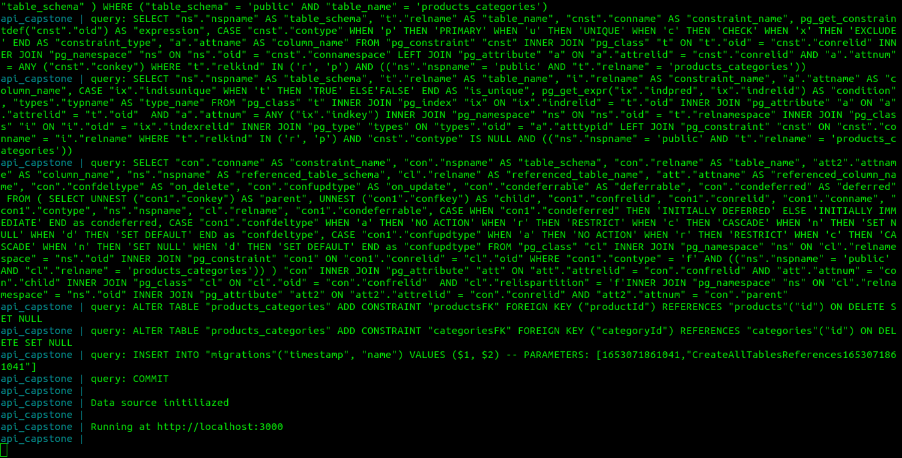
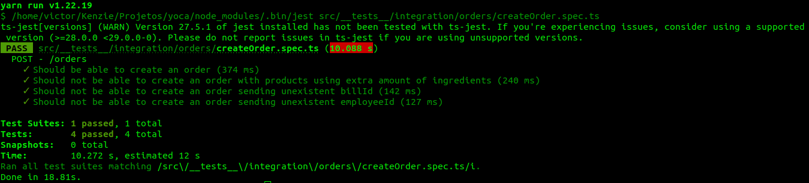

# Yoca - Gerenciador de Restaurantes

**URL base da API** -> https://cayoca.herokuapp.com

## Sobre o projeto

Restaurantes enfrentam muitas demandas e precisam administrar/gerenciar seus produtos e funcionários todos os dias, para tornar todos esses processos mais simples e centralizar suas informações desenvolvemos um sistema de administração com objetivo de gerenciar pedidos, funcionários e estoque.
Com o Yoca você pode cadastrar seus funcionários, cadastrar novos produtos com suas respectivas informações, assim como cadastrar novos ingredientes e administrar o estoque desses ingredientes, além de registrar novos pedidos assim como editar seus respectivos status e relacioná-los com uma comanda para pagamento por parte do cliente. Também temos um endpoint para caso o cliente queira deixar um feedback sobre o restaurante ou sobre um produto em específico.

**Link para a documentação** -> https://cayoca.herokuapp.com/api/docs

Arquivo `json` para usar no **insomnia** -> [Clique aqui](https://drive.google.com/file/d/1FB88eVzbDHfkmrzHgcJbIEoOqEf_M9N5/view)

## Rodando o projeto

Para rodar o projeto em ambiente de desenvolvimento basta que você configure suas variáveis de ambiente (.env) e execute o comando `docker-compose up --build`, assim ele irá criar a imagem e os bancos, de desenvolvimento e de testes, e irá estabelecer as conexões. Após isso basta utilizar os endpoints na url http://localhost:3000.

## Testes

Toda a aplicação conta com testes de integração que cobrem todas as principais rotas a serem usadas na API, para isso utilizamos o Jest juntamente com o Supertest. O banco de dados que armazena os dados criados a cada teste é gerado em um ambiente docker, para isso utilizamos o docker-compose, com um arquivo .yml.

## Rodando os testes

Como temos muitos testes de integração devido a quantidade de rotas, além de prezar pelo desempenho, tanto dos testes quanto da sua máquina, vamos instalar o jest globalmente para conseguirmos rodar os testes individualmente, assim conseguimos evitar problemas nos testes e em máquinas menos potentes.
Para começar rode `yarn global add jest` ou `npm install -g jest` em sua cli. Após isso vamos definir a variável que será o seu database de testes, preencha-a no seu .env com o valor desejado, além das credenciais que serão usadas na sua conexão com o postgres. Agora execute `docker-compose up --build` e aguarde o database ser criado. Logo após o database ser criado já podemos executar nossos testes! Então rode `yarn jest caminho/do/arquivo`. Exemplo:

